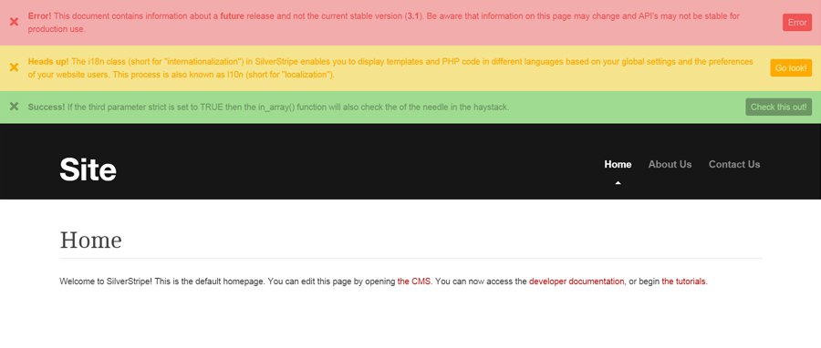
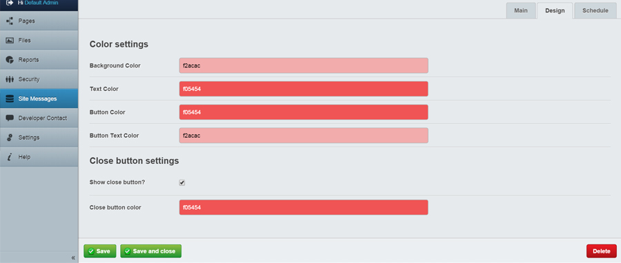

# Site Messages
The Site Messages module allows CMS users to create customized colored messages at the top of their Silverstripe website.


# Requirements
```
silverstripe/cms: ~3.1.3"
silverstripe/framework: ~3.1.3
tractorcow/silverstripe-colorpicker: 3.0.*
```
# Installation

##### Manual
* Install the contents of this repository into the root folder of your Silverstripe project
* Run /dev/build?flush=all

##### Composer
```
composer require christohill/silverstripe-sitemessages
```

**Add $SiteMessages variable to your template where you'd like your messages to appear**

# Usage
> Note: accounts that are not "Administrator" will need to have permissions added to their account to use Site Messages.

After installation "Site Messages" will be added to your left side menu. You can create, edit, delete and schedule your site messages from here. Colors are totally customizable by use of the ColorPicker module.


